# Haven: A mobile app for helping autistic people find sensory-friendly places

## Introduction and Background

Autistic people often suffer from sensory hyper- and hypo-sensitivities that make many public places inaccessible to them. It is therefore important for them to be able to predict in advance what the sensory environment of a given place is like in order to avoid distress and plan strategies to accommodate their needs. However, this information is difficult to access which represents an accessibility barrier for many autistic people. This is symptomatic of a wider lack of tools and technologies for helping autistic adults improve their quality of life. Part of the difficulty in creating such tools are the challenges of involving autistic adults in the design and evaluation processes. 

In this project, a novel mobile app was designed, developed and evaluated that helps autistic people find the information they need about places. The app encourages users to contribute information about their own experience of places they have been to continuously and iteratively improve the accuracy of information provided. To the best of our knowledge, no such app is currently available. 

A method was designed and evaluated to automate the generation of initial data for the app. Ultimately, the app will rely on user-submitted data, but in order to motivate users to begin using and contributing to the app, it must contain some initial starting data. Online reviews were collected and input to a targeted aspect-based sentiment analysis model, whose outputs were transformed into a set of Likert scale ratings for six sensory aspects of each place (noise, brightness, busyness, spaciousness, comfortable seating and smell). The accuracy of these estimations was evaluated by comparison with ground-truth sensory ratings. 

A collaborative design process was used at every stage of the app's design and development. Autobiographical design methods were used in combination with iterative cycles of design, development and feedback from prospective users. The ability of users to contribute their own data to iteratively improve the information the app provides will be complemented with analysis of the qualitative data submitted (such as reviews) to improve the relevancy and usefulness of displayed information, and the ability of users to provide feedback and suggestions about potential extra features and changes to the interface. A key feature of the app that was met with great interest and approval from the autistic community was that it was created by the community, for the community.  

## Video Demo

## Features

The app includes:
- An onboarding process
- A map-based interface populated with selectable place markers
- Place information (viewable upon clicking a marker), including a description, accessibility information, user reviews, images, audio files and Likert scale sensory ratings (a scale from 1-5 i.e. low to high for each of the following sensory aspects: noise, brightness, spaciousness, busyness and smell. For example, a rating of 1 for noise indicates a very quiet place).
- A filtering mechanism, with which users can filter the places they are shown on the map by:
  - The type of location (e.g. cafe, restaurant, bar, bakery, etc)
  - An accessibility or dietary needs (currently it is possible to filter for wheelchair accessible locations, places with outdoor seating, and vegetarian options - more to come)
  - The sensory features of the place, as a Likert scale range from 1 (low) to 5 (high) in each of the sensory aspects (noise, brightness, spaciousness, busyness, smell). For example, a user might select for only quiet places by applying a filter of 1-2 in the noise aspect.
- A settings page which enables users to choose whether or not to turn on location services (off by default), in order to center the map on their current location. This is a convenience, but not required to use the app, as explained later. No location data is collected or stored by the app.  

Users also have the ability to contribute information relating to their own experience of a place in the form of sensory ratings, reviews, images and audio files. 

A back end is connected to the interface that includes an authentication service and two databases (one for storing text-based and numerical information and one for storing images). Back end services are provided by Firebase. 

Users must authenticate in order to contribute data to the database, but all other services are available without signing in. No personal data is collected by the app. To center the map, users can choose to either use their current location (by turning on the location services in the Settings page), or to select a starting location from a dropdown menu of options in the filtering pathway, or to use the default location (the University of Bristol). No location data is collected or stored in any case.

An NLP model-based process was established and evaluated for populating the app with initial Likert scale sensory ratings, while place coordinates, descriptions and accessibility information were sourced from the Google Maps API.

The following images demonstrate a user journey; a GIF demo is also shown above demonstrating the app's basic use. 

|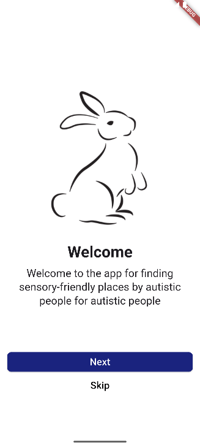|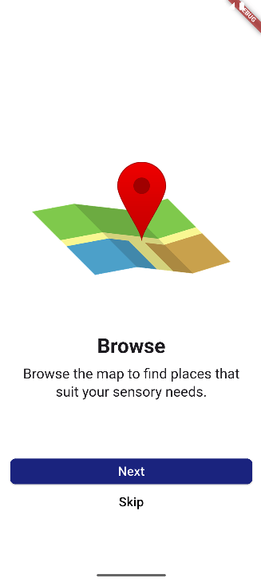|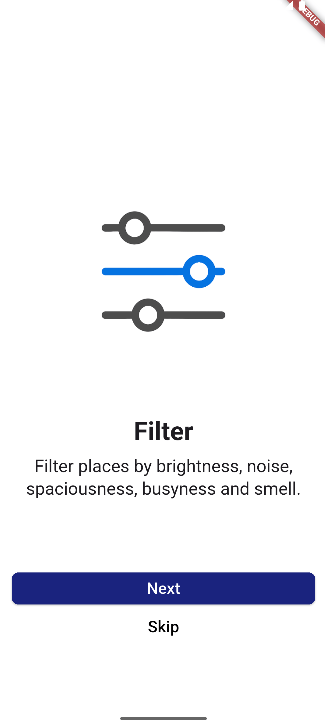|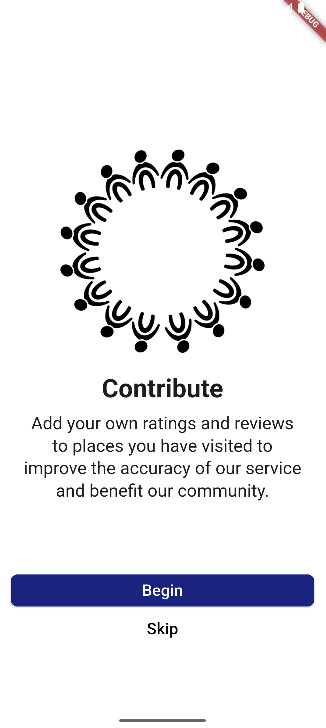|
|:-:|:-:|:-:|:-:|
|Onboarding 1|Onboarding 2|Onboarding 3|Onboarding 4|

|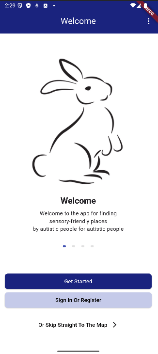|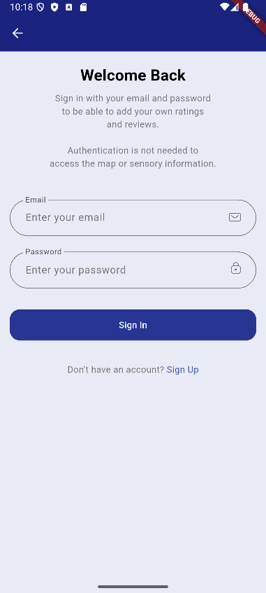|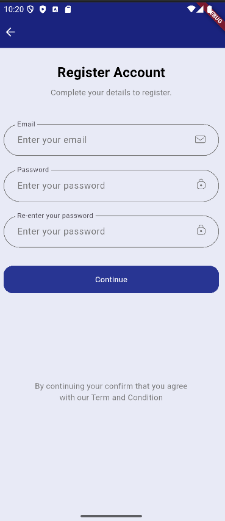|
|:-:|:-:|:-:|
|
Home Screen
|
Sign In Screen
|
Register Screen
|

|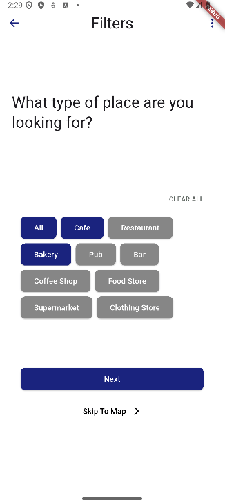|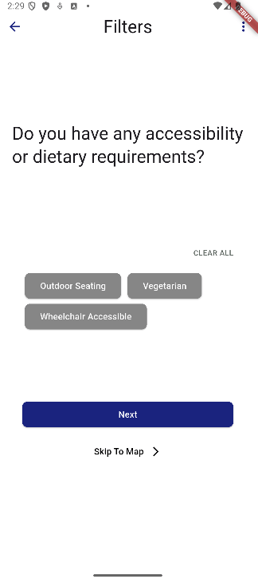|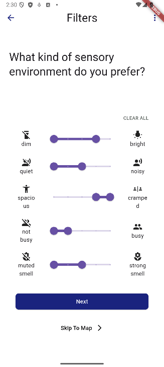|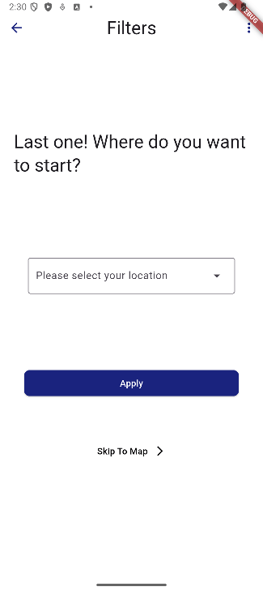|
|:-:|:-:|:-:|:-:|
|
Filter Screen 1 (place type)
|
Filter Screen 2 (Accessibility/dietary needs)
|
Filter Screen 3 (Sensory requirements filter)
|
Filter Screen 4 (select starting location
|

|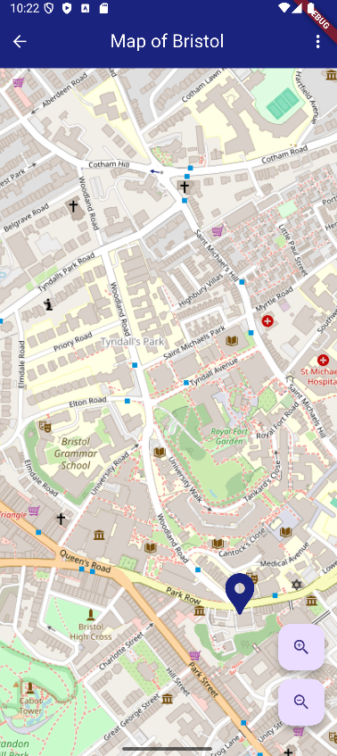|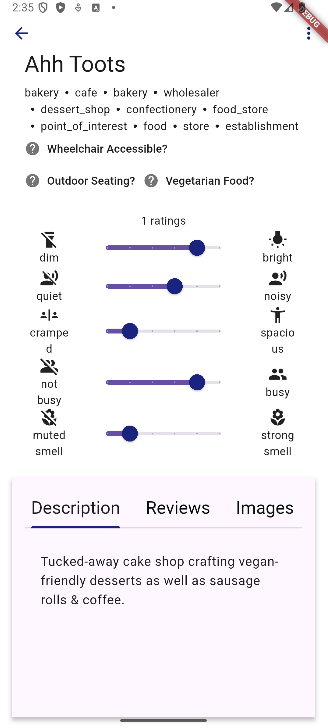|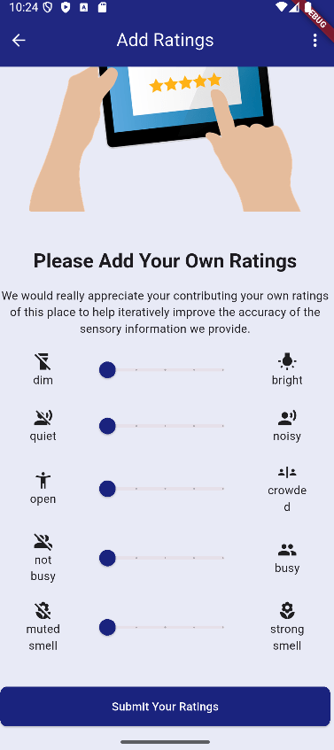|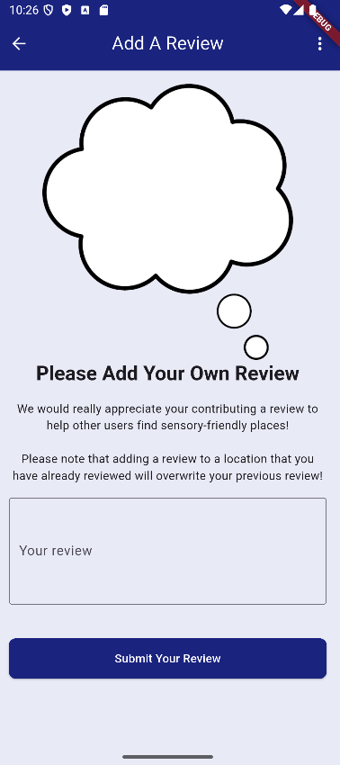|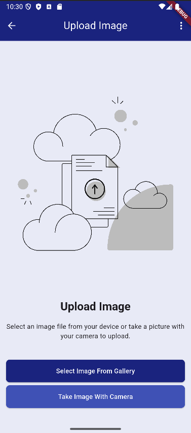|
|:-:|:-:|:-:|:-:|:-:|
|Map|Place Information Screen|Add a User Rating Screen|Add a User Review Screen|Add a User Image Screen|

## Future Developments

The app in its current state constitutes a minimum viable product, however interviews and evaluations with members of the target audience have raised many additional features and developments to be implemented in the future, including:

- Adding a Search function that allows users to search for places by name for easy access
- A user History function that enables users to scroll through a history of places that they recently viewed in the app. This will make returning to the page of places that they have viewed (for example, to contribute information about them to the app once they have visited in person) easier and more inviting.  
- Including information about any autism friendly hours that places may accommodate, particularly any afternoon autism friendly hours that would be preferable for the many autistic people who keep `back to front' hours.
- Displaying whether or not the place plays music, whether there are any times that they turn the music off, and what times they turn the music volume up or down.
- Enabling users to upload audio recording as well as images, so that users can play back the audio recordings to directly ascertain the acoustics of the place.
- Including social scripts for certain types of places, such as post offices, cinemas and supermarkets, that describe the step-by-step algorithm for conducting common operations in a particular environment. 
- Adding an AI generated description of the place, or of each sensory aspect of the place. This would initially be based on reviews sourced from the Internet and later, once enough data had been collected, from the more targeted reviews contributed by the app's own users
- Including easy-to-access processes through which users can feed back their experience of using the app, suggest any improvements and request additional features or information to be included. This will be crucial for the app's goal of iteratively developing in collaboration with the community it serves in order to maximise not only its utility and usability, but also their sense of empowerment.
- Once enough user data regarding the sensory features of places has been collected, a high priority of future development will be analysing and displaying the sensory features as a function of time. In other words, showing how the sensory features of a place change over the course of a day, a week, or a year, similar to the busyness chart displayed by Google Maps. 
